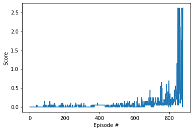

## Solution Video

## Learning Algorithm

My learning algorithm is a Deep Deterministic Policy Gradient.  

DDPG is an actor-critic algorithm and primarily uses two neural networks.  
One for the actor and one for the critic. These networks calculate action vectors for the current state and and generate 
a temporal-difference error signal each time step.

DDPG uses a stochastic behavioral policy for good exploration and a deterministic target policy for estimating.

The current state is the input of the actuator network and the output is a single value representing the action. The deterministic policy gradient theorem provides the update rule for the weights of the actor network.  

The critic's output is simply the estimated Q-value of the current state and the action given by the actor.
The critic network is updated from the gradients obtained  from the TD error signal.

My implementation is based on "[DRLND_P2_Continuous-Control](https://github.com/tobiassteidle/DRLND_P2_Continuous-Control)" and extended by details like e.g. batch normalization and modfied hyperparamters.

In my implementation the Actor network contains two hidden layers of 128 and 64 units with ReLU activation applied to both layers and a tanh on the end.  
In addition, a batch normalization is applied to the input and between the hidden layers.  

The Critical network also has two hidden layers with 128 and 64 units and ReLU Activation on both layers.

More general information about DDPG in [this](https://arxiv.org/pdf/1509.02971.pdf) paper.   

### Hyperparameters
Parameter | Value
--- | ---
replay buffer size | int(1e6)
minibatch size | 1024
discount factor | 0.99  
tau (soft update) | 1e-3
learning rate actor | 1e-4
learning rate critic | 1e-3
L2 weight decay | 0
update every steps | 20
update per step | 10

### Plot of Rewards

Episodes | Average Score | Max | Min | Time
--- | --- | --- | --- | ---
... | ... | ... | ... | ...
Episode 800 | Average Score: 0.14 | Max: 0.30 | Min: 0.19  | Time: 1.74
Episode 810 | Average Score: 0.14 | Max: 0.10 | Min: -0.01 | Time: 0.56
Episode 820 | Average Score: 0.15 | Max: 0.10 | Min: -0.01 | Time: 0.56
Episode 830 | Average Score: 0.16 | Max: 0.20 | Min: 0.19  | Time: 1.18
Episode 840 | Average Score: 0.17 | Max: 0.39 | Min: 0.30  | Time: 2.46
Episode 850 | Average Score: 0.25 | Max: 2.60 | Min: 2.60  | Time: 14.60
Episode 860 | Average Score: 0.36 | Max: 2.10 | Min: 2.09  | Time: 14.27
Episode 870 | Average Score: 0.44 | Max: 1.80 | Min: 1.69  | Time: 10.44

Environment solved in 877 episodes!	Average Score: 0.51

## Ideas for Future Work

- Change network sizes and choose different hyperparameters
- Trying other algorithms like PPO, A3C or D4PG
- Use parameter space noise rather than noise on action. https://vimeo.com/252185862
- Current our replay buffer is dumb. We can use prioritised experience buffer. https://github.com/Damcy/prioritized-experience-replay
- Different replay buffer for actor/critic
- Try adding dropouts in critic network